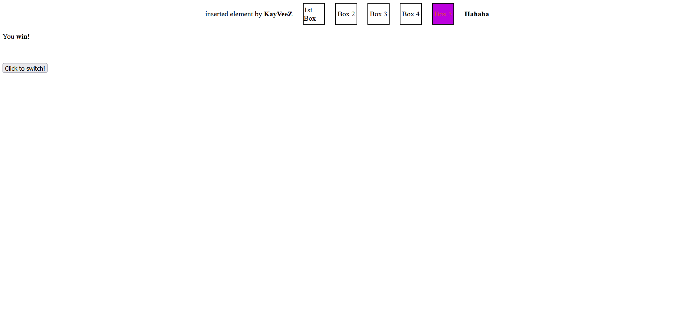

# Try to Win (a minigame)

This JavaScript script creates a simple game where the player has to press keys on the keyboard to increase or decrease their lives. The objective is to reach 20 lives to win the game.

## Features
- **Random Color Change**: Boxes representing different elements of the game change color randomly at regular intervals.
- **Dynamic Styling**: Styles of elements are dynamically modified using JavaScript.
- **Game Logic**: Player's lives are updated based on key presses, and a win or lose condition is determined.

## How It Works
- The script starts by hiding the main container element.
- It defines functions to generate random colors and key codes, and to make decisions for game logic.
- The game continuously updates the colors of certain elements at regular intervals.
- When the player presses keys, their lives are updated accordingly.
- If the player reaches 20 lives, they win the game. If their lives drop to zero or below, they lose.
- The game stops further key events once a win or loss condition is reached.

### How it looks
1. This is how it looks when it loads first:

2. When you lose:

3. When you win:
